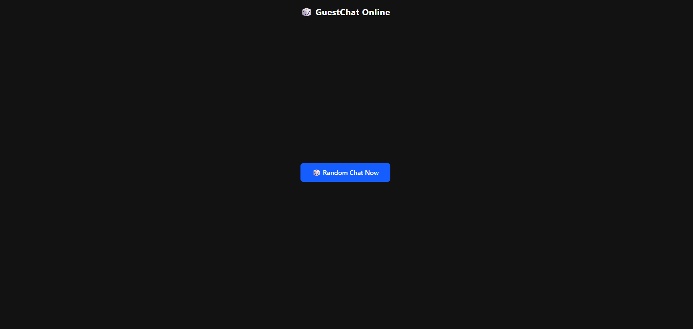

# 💬 Chat Random App (Fastify + React + Vite + Socket.io + Docker)

โปรเจกต์นี้เป็นระบบ **แชทสุ่ม (Random Chat)** ที่สามารถให้ผู้ใช้สุ่มจับคู่และสนทนากันได้แบบเรียลไทม์  
พัฒนาโดยใช้ **Fastify + Socket.io** สำหรับฝั่ง Backend  
และ **React + Vite + TailwindCSS** สำหรับ Frontend  
พร้อมรองรับการรันผ่าน **Docker Compose** แบบง่าย ๆ 🚀

## 🐳 เริ่มต้นใช้งาน

### 🔹 รันด้วย Docker

docker-compose up -d --build

จากนั้นเข้าใช้งานได้ที่:

Frontend: http://localhost:5173

Backend: http://localhost:3001

   

   

